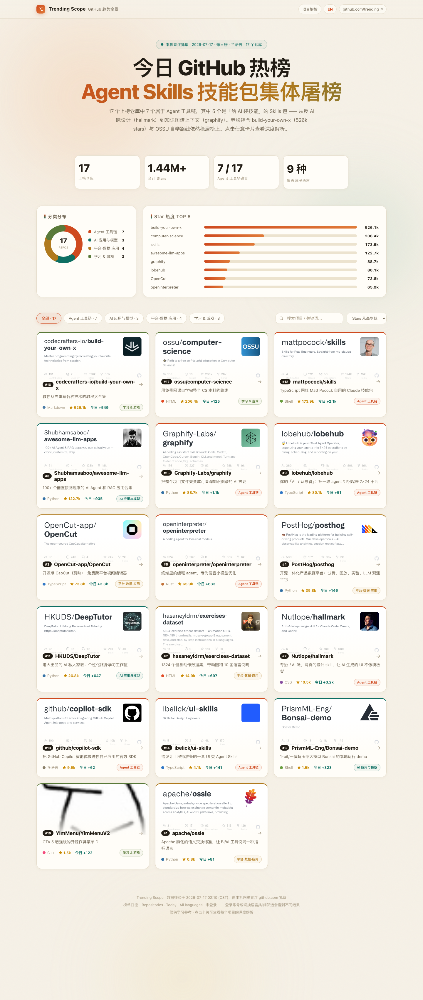
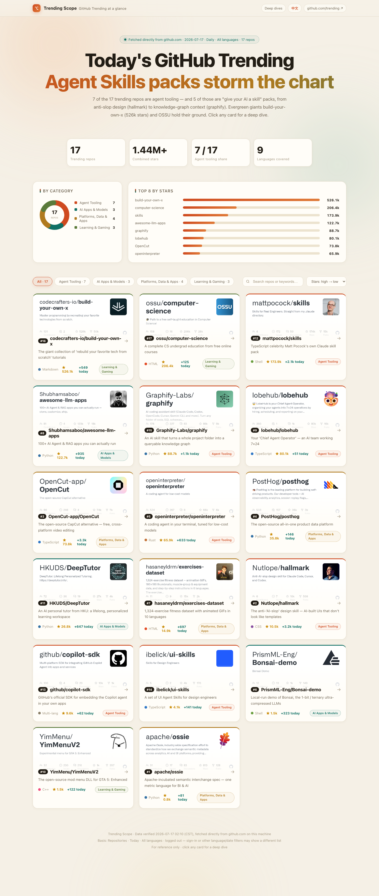

# GitHub Trending Scope

> 把 github.com/trending 变成一页可看、可搜、可交互的双语全景报告
> Turn github.com/trending into an interactive bilingual one-page report.

## 宣传视频 / Promo Video · 45s

| 🇨🇳 中文宣传片 | 🇺🇸 English Promo |
| --- | --- |
| <video src="https://john-hoe.github.io/github-trending-scope/videos/promo-zh.mp4" poster="preview-zh.png" controls muted playsinline width="100%"></video> | <video src="https://john-hoe.github.io/github-trending-scope/videos/promo-en.mp4" poster="preview-en.png" controls muted playsinline width="100%"></video> |

无法内嵌播放？/ Can't play inline? 直接下载 / Download：[中文宣传片](videos/promo-zh.mp4) · [English Promo](videos/promo-en.mp4)



## 这是什么 / What is this

每天 GitHub Trending 的榜单只是一串链接。**Trending Scope** 把它做成一个单文件、零依赖的本地网页：

GitHub Trending is just a list of links. **Trending Scope** turns it into a single-file, zero-dependency local web page:

- **17+ 上榜仓库的深度解析** / Deep dives for every trending repo —— 点击卡片弹出：是做什么的 / 仓库里有什么 / 技术栈 / 应用场景 / 为什么火（What it does · What's inside · Tech stack · Use cases · Why it's hot）
- **中英双语** / Bilingual —— `index.html`（中文）与 `index-en.html`（English）一键切换
- **图表洞察** / Charts —— 分类环形图 + Star 热度 TOP 8 条形图，动画呈现
- **交互** / Interactions —— 分类筛选、实时搜索（防抖）、四种排序（榜单排名 / Stars / 名称）、「今日 +N」新增 star 徽章、卡片 / 紧凑列表双视图（cards or compact list view）
- **设计** / Design —— 暖纸编辑部风格配色 + 墨黑暗色模式（跟随系统 / 手动切换，dark mode follows system or manual toggle）、极光背景、滚动入场动画、键盘可访问（Enter 打开 / Esc 关闭弹窗）



## 怎么用 / Usage

无需安装任何东西，直接用浏览器打开：

No build, no dependencies — just open in a browser:

```bash
open index.html      # 中文版
open index-en.html   # English version
```

## 每日自动更新 / Daily auto-update

榜单数据由 **GitHub Actions 每天自动刷新**（北京时间约 08:23，见 `.github/workflows/daily-update.yml`）：

The trending data is refreshed daily by GitHub Actions (~08:23 Beijing time):

- `scripts/update.py` 直连 `github.com/trending` 抓取榜单，刷新 `data.json` + `data.js`，并把当日快照归档到 `archive/YYYY-MM-DD.json`
- **多口径榜单**：每日 / 每周 / 每月 × 7 个语言筛选（All / Python / TypeScript / JavaScript / Rust / Go / C++）共 21 个榜单一次抓全，页面工具栏可切换口径与语言，支持 `#board=weekly&lang=python` 深链
- Daily / Weekly / Monthly × 7 language filters (21 boards total) — switchable in the toolbar, with `#board=…&lang=…` deep links
- 仍在榜的仓库**保留人工深度解析**，只更新排名与 star 数；新上榜仓库自动生成带 ⚡ 标记的摘要，人工精评随后补充
- **在榜追踪**：卡片显示「首次上榜 / 回榜 / 在榜 N 天」徽章，弹窗含 star 增长 sparkline（自 2026-07-17 起逐日积累）
- Repos that stay on the chart keep their human-written deep dives (only rank/stars update); new entries get an auto summary flagged ⚡ pending a human write-up. On-chart tracking badges and a star-history sparkline build up from the daily archives
- 手动更新 / Manual refresh: `python3 scripts/update.py`（纯标准库，无依赖 / stdlib only）
- 改进方向见 / See `docs/improvement-roadmap.md`

## 数据说明 / Data notes

- 当前数据时间见页脚与 `data.json` 的 `meta.generated_at`，抓取口径为 `github.com/trending`（Repositories · 每日/每周/每月 × 语言筛选 · 未登录），页面默认展示每日·全语言榜。
- 登录 GitHub 账号或切换语言/时间筛选，看到的榜单可能不同。
- Data timestamp: see the page footer or `meta.generated_at` in `data.json` (Repositories · Today · All languages · logged out). Signed-in users or other filters may see a different list.

## 仓库结构 / Structure

```
├── index.html        # 中文版页面（样式+渲染逻辑，数据来自 data.js）
├── index-en.html     # English page (styles + rendering, data from data.js)
├── data.json         # 双语数据源（canonical dataset, zh + en）
├── data.js           # data.json 的页面加载包装（window.TRENDING_DATA，自动生成）
├── archive/          # 每日榜单快照（YYYY-MM-DD.json，在榜追踪的历史依据）
├── scripts/update.py # 每日抓取更新脚本（stdlib only）
├── .github/workflows/daily-update.yml  # GitHub Actions 每日自动更新
├── docs/improvement-roadmap.md         # 改进路线
├── videos/           # 45s 宣传视频（中文 promo-zh.mp4 / English promo-en.mp4）
├── preview-zh.png    # 中文版整页预览
├── preview-en.png    # English full-page preview
└── LICENSE           # MIT
```

## License

[MIT](LICENSE) © 2026 john-hoe
